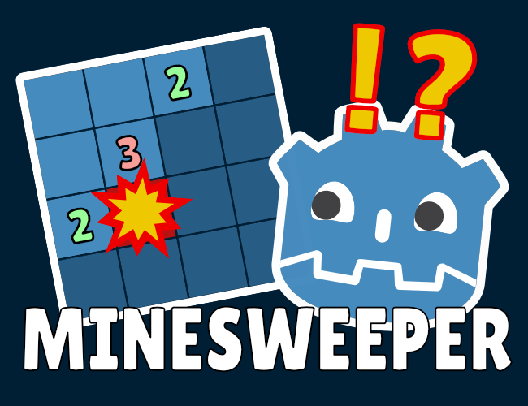
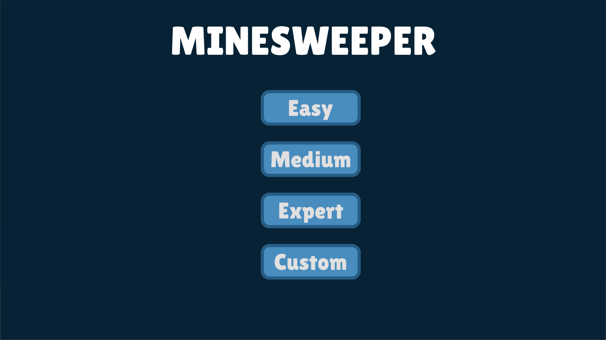
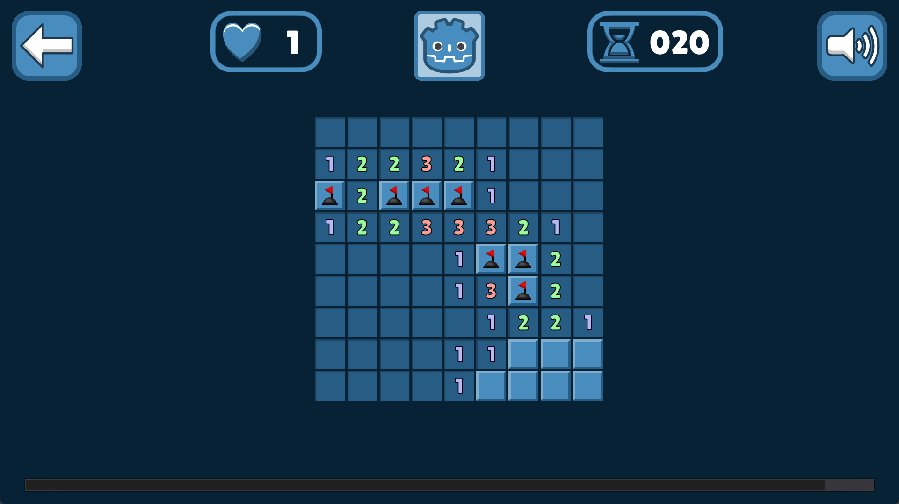
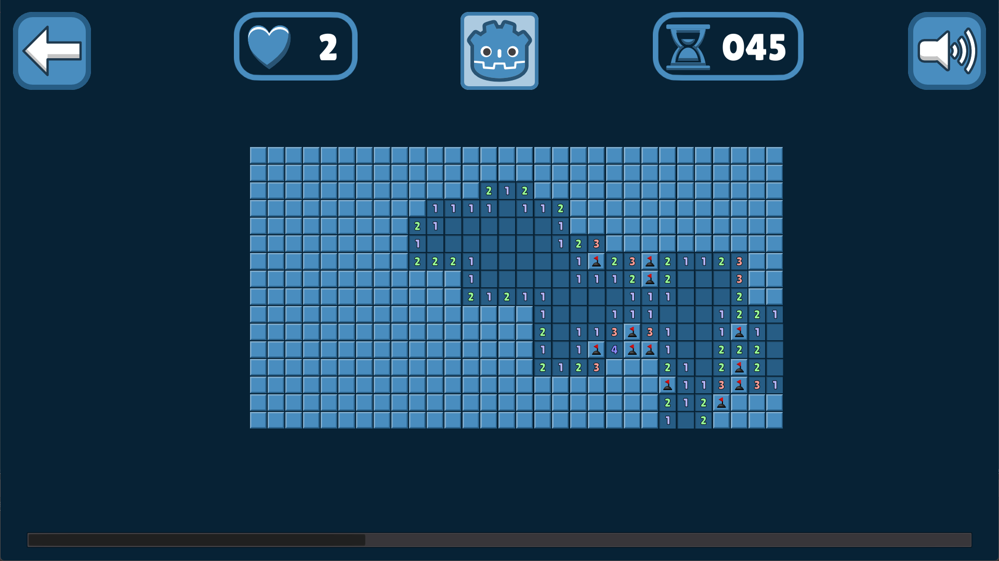
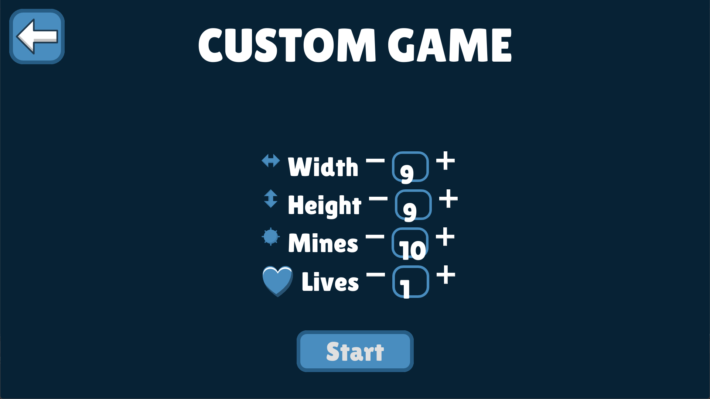

# Minesweeper

## About

Minesweeper game made using Godot 3.5.3 and C#.

Godot version 3.x was chosen over 4.x due to superior support for the web as of the time of development.

## Features

* Three classic modes
  * 9x9 grid; 10 mines
  * 16x16 grid; 40 mines
  * 30x16 grid; 99 mines
* Creating custom modes
* Optional multiple lives

## Screenshots

